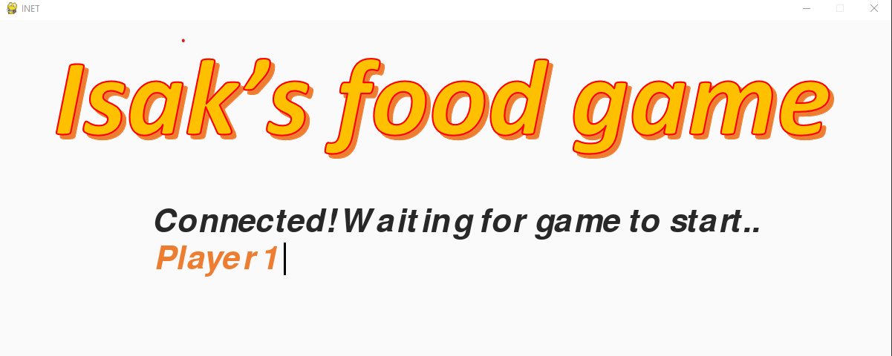
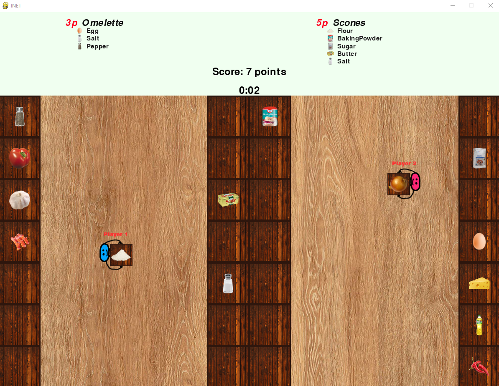

# Internet Game

Multiplayer cooperation game utilizing UDP communication. Made as an assignment for a course in programming paradigms at KTH. This repo is cloned with the original commits from my KTH Enterprise GitHub repository, and the entirety of the source code is written by me.

Most work was put into the game server, which is written in Kotlin and contains all of the game logic. The game client is written in Python and makes use of the Pygame library. Little effort was put into graphics and design, since the purpose of the assignment was to show skills in socket communication and game logic implementation,

The source code contains comments in english. The originial documentation is in swedish and can be found in the files mentioned below:
- "spel.txt": Introduction to the game.
- "protokoll.txt": Explains the communication protocol for the game.
- "State format.txt": Example with explanations regarding how the game state is communicated from the server to the client.
- "State diagram.pdf": Graphs showing the transitions between different states of the client and server.

 

 

